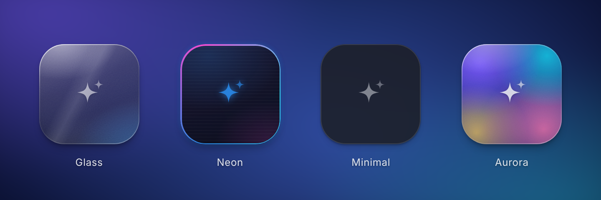
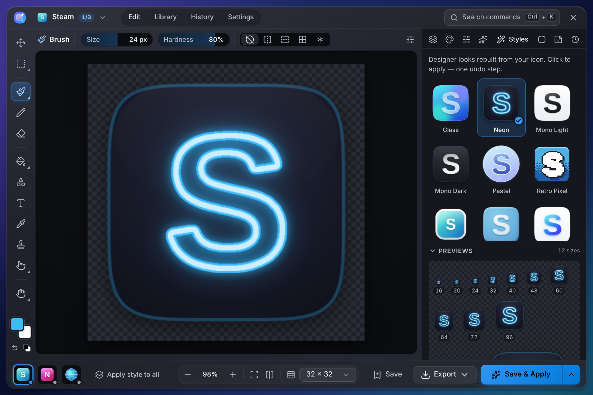

# Reskin

**A small glass box that floats on your Windows desktop.** Drag a shortcut onto
it and the box opens into an icon editor loaded with that app's icon. Draw,
restyle or start from a preset, then press **Save & Apply**: the box carries
the new icon back to the desktop and drops it onto the real shortcut.

- A small installer that needs no admin rights. No telemetry, no account.
- Every change is journaled and can be undone — one icon or all of them.
- Works on Windows 10 and 11 (x64).

<p align="center"></p>

## Download

Get the latest version from the **[Releases](https://github.com/KarimEidou/Reskin/releases)** page:

| File | What it is |
| --- | --- |
| `Reskin_<version>_x64-setup.exe` | Recommended. Installs for your user only (no admin prompt), adds a Start-menu entry and an uninstaller. |
| `Reskin_<version>_x64_en-US.msi` | The same app as an MSI package (per-machine; for managed deployments). |
| `Reskin_<version>_x64_portable.exe` | Runs without installing (see [Portable use](#portable-use)). |
| `THIRD_PARTY_NOTICES.txt` | Licenses of the open-source software inside Reskin (also in **Settings → About → Open-source licenses**). |
| `SHA256SUMS.txt` | Checksums — verify with `Get-FileHash .\Reskin_*_x64-setup.exe` in PowerShell. |

### "Windows protected your PC"

Reskin isn't code-signed yet, so Microsoft Defender SmartScreen may warn the
first time you run the installer. Click **More info → Run anyway**. You can
compare the file's SHA-256 with `SHA256SUMS.txt` from the same release first.

Reskin needs the Microsoft Edge **WebView2 Runtime**, which ships with
Windows 11 and current Windows 10. The installer downloads it automatically
if it is missing.

## Using Reskin

1. **Drop** a desktop shortcut (or several), a folder, an internet shortcut
   (Steam and Epic games included), a program or an image onto the box — or
   right-click a shortcut or folder in Explorer → **Reskin this icon** (turn
   it on in Settings; on Windows 11 it is under *Show more options*).
   Clicking the box opens the Start page; right-click it, or the tray icon,
   for the menu.
2. **Edit** the icon: brush, spray, pencil, shapes, text, fills and
   gradients, selections (rectangle, ellipse, lasso, magic wand), smudge,
   blur / sharpen and dodge / burn, stickers and emoji, layers with blend
   modes and effects, 20+ adjustments, a backdrop generator and style presets
   that restyle *your* icon (Glass, Neon, Clay, Sticker, Retro Pixel…).
   Previews show every icon size from 16 to 256 px, the icon on your real
   wallpaper and on the taskbar.
3. **Save & Apply.** The editor folds back into the box, the box flies to the
   shortcut on your desktop and swaps its icon as it lands. An **Undo** chip
   stays on the box for a few seconds. With several items queued, each apply
   opens the next one (with an Undo of its own) until the last flies home.

<p align="center"></p>

| Drop this | Reskin does |
| --- | --- |
| Shortcut (`.lnk`) | Changes its icon in place. A Store app's shortcut, whose own icon Windows ignores, gets a classic shortcut with your icon instead. |
| Internet shortcut (`.url`) | Changes its icon in place (Steam / Epic too). |
| Folder | Sets a custom folder icon (`desktop.ini`). |
| Program (`.exe`) or any file | Creates a new desktop shortcut with your icon — Reskin never modifies programs. |
| Image (`.png`, `.jpg`, `.ico`, …) | Starts a design from it (or adds it as a layer). |
| Reskin project (`.reskin`) | Opens the saved design. |
| Several items | Queues them; design one and use **Apply style to all**. |
| System icons | Right-click the box → **System icons** (This PC, Recycle Bin, User files, Network, Control Panel). |

**Open image…** (`Ctrl+O`) picks images, icons, shortcuts, programs and
`.reskin` projects. While a design is open, whatever you drop, pick or paste
asks first whether it becomes a layer or a new item in the queue — nothing
you are editing is replaced.

Shortcuts on the **Public Desktop** (shared by all users) need administrator
approval: Reskin asks first, and offers a *personal copy* on your own desktop
instead. Other items Windows won't let you change (read-only shortcuts, the
all-users Start menu) can't be changed in place; Reskin says so before it
touches anything and offers the personal copy for shortcuts.

### Handy keys

| Key | Action |
| --- | --- |
| `Ctrl+Alt+Shift+R` | Show / hide the box (change it in Settings) |
| `Ctrl+K` | Command palette — every command, adjustment and style |
| `?` | All keyboard shortcuts |
| `V` · `M` `Shift+M` · `L` · `W` | Move, rectangle / ellipse select, lasso, magic wand |
| `B` · `A` · `P` · `E` | Brush, spray, pencil, eraser |
| `G` · `Shift+G` · `U` · `T` · `I` · `S` | Fill, gradient, shapes, text, eyedropper, sticker stamp |
| `R` · `Shift+R` · `O` | Smudge, blur / sharpen, dodge / burn |
| `H` · `Z` · hold `Space` | Hand, zoom, pan while held |
| `M`, `B` or `R` again | Next tool of the group: rectangle ↔ ellipse, brush ↔ spray, smudge → blur / sharpen → dodge / burn |
| `X` / `D` | Swap / reset the colours |
| hold `\` | Compare with the original icon |
| `Ctrl+Z` / `Ctrl+Y` | Undo / redo |
| `Ctrl+S` / `Ctrl+Enter` | Save to Library / Save & Apply |

### Settings worth knowing

- **Appearance:** dark / light / system theme, Windows accent colour, box
  skin (Glass, Neon, Minimal, Aurora), box size, opacity at rest and editor
  size.
- **Motion:** animation speed, reduced motion (follows Windows by default),
  morph or crossfade when the editor opens, and whether the new icon flies
  to the desktop.
- **Behaviour:** the global shortcut (a key with Ctrl, Alt or Win; F1–F24
  also with just Shift), start with Windows, Explorer context-menu entry
  *Reskin this icon*, hide the box during full-screen apps (**Show box** in
  the tray brings it back over one), also update matching Start-menu and
  taskbar-pin shortcuts (undone together with the icon), sounds.
- **Advanced:** compatibility mode (opaque windows for remote desktop or
  unusual graphics drivers), low-memory mode (closes the editor completely
  when you're done), refresh desktop icons (or rebuild the icon cache), the
  sizes written into `.ico` files and the pixel-art grid.

## Restoring icons

- **One icon:** the Undo chip on the box right after applying, or
  **History → Undo / Restore original** in the editor. Undo also undoes the
  matching Start-menu and taskbar pins the apply changed.
- **Everything:** right-click the box (or the tray icon) → **Restore all
  icons…**, **History → Restore all…**, or run `reskin.exe --restore-all`
  from a terminal — also while Reskin is running. It exits with code 0 when
  every icon is back and 3 otherwise. Public-Desktop items ask for
  administrator approval once (per 64 items). From a terminal run as
  administrator it starts itself again as the signed-in user and restores
  their icons (if it can't, it changes nothing and exits with 3). An item
  you have deleted since counts as restored: nothing of it is left to put
  back.

Reskin is a windowed program, so a terminal doesn't wait for it to finish
(a `.cmd` script does). To wait for `--restore-all` and see its exit code,
run it from the folder that holds `reskin.exe` (`%LOCALAPPDATA%\Reskin` when
installed with the setup). In Command Prompt:

```bat
start /wait reskin.exe --restore-all
echo %ERRORLEVEL%
```

In PowerShell:

```powershell
(Start-Process .\reskin.exe -ArgumentList '--restore-all' -Wait -PassThru).ExitCode
```

### Uninstalling

- **Installer (`…-setup.exe`):** the uninstaller removes the Explorer entry
  and "Start with Windows". If you tick *Delete app data*, Reskin first
  puts back every icon it changed (as the signed-in user, even when the
  uninstaller runs as administrator; Public-Desktop items ask for
  administrator approval); if any icon can't be put back, it says so and
  keeps its data, so your icons keep working and can still be restored. For
  a silent uninstall that does the same, run
  `uninstall.exe /S /DELETEAPPDATA`. The restore also deletes the
  Public-Desktop icons it no longer needs (unless a Public Desktop shortcut
  still shows them); the shared `%ProgramData%\Reskin` folder itself stays,
  since other accounts on the PC may use its icons.
- **MSI package:** uninstalling removes the Explorer entry but leaves
  Reskin's data and the icons it applied alone. Use **Restore all icons…**
  and turn off **Start with Windows** first.

Reskin stores its icons in `%LOCALAPPDATA%\com.karimeidou.reskin\icons`
(Public-Desktop icons in `%ProgramData%\Reskin\icons`, a folder only
administrators can change). Its settings, history journal, Library and
unsaved-design backup live in `%APPDATA%\com.karimeidou.reskin`. If Explorer
keeps showing an old icon, use **Settings → Refresh desktop icons**.

## Portable use

`Reskin_<version>_x64_portable.exe` runs from anywhere (a USB stick, a
folder). It keeps settings and icons in the same folders as the installed
app, and it needs the WebView2 Runtime: when that is missing, Reskin says so
as it starts and offers to open Microsoft's download page. Your new icons
keep working without the exe. Before you delete it, turn off **Start with
Windows** and the Explorer entry, and use **Restore all icons…** if you want
the original icons back.

## Privacy

Reskin works entirely offline. It has no telemetry, no update pings and no
accounts; the only network access is the WebView2 bootstrapper the installer
may run (links such as Releases open in your browser). Diagnostics go to
`%TEMP%\reskin.log` on your machine only.

## Building from source

Requirements: Windows 10/11 x64, [Node.js](https://nodejs.org) 22 with
pnpm 10 (`corepack enable`), Rust via [rustup](https://rustup.rs) (the
toolchain is pinned in `rust-toolchain.toml`), the Visual Studio C++ build
tools and the WebView2 Runtime.

```powershell
pnpm install
pnpm tauri dev        # run with hot reload
pnpm tauri build      # installers in target\release\bundle
```

Checks (the same as CI):

```powershell
pnpm check; pnpm test; pnpm build; pnpm bundle:budget; pnpm e2e
cargo fmt --all --check
cargo clippy --workspace --all-targets -- -D warnings
cargo test --workspace -- --include-ignored   # real shell tests too; run elevated, as CI does
pnpm bindings; git diff --exit-code            # the IPC types are up to date
```

`pnpm docs:screenshots` renders the pictures in this README from the app's
pages. Helper modes: `reskin.exe --self-test` prints a JSON health report,
`--smoke-test [--capture-handoff]` exercises the packaged app end to end,
`--restore-all [--quiet]` puts every icon back. A release build is a
windowed program that a terminal doesn't wait for: run
`.\reskin.exe --self-test | Out-String` in PowerShell or
`start /wait reskin.exe --self-test` in Command Prompt to see the report
(and `--restore-all` as in [Restoring icons](#restoring-icons)).

## How it's built

A [Tauri 2](https://tauri.app) app: Rust for the Windows side and a Svelte 5
+ TypeScript front end in two transparent WebView2 windows, the box and the
editor, which hand over to each other seamlessly. The image engine is plain
TypeScript and runs in a worker where it pays off. See
[`docs/ARCHITECTURE.md`](docs/ARCHITECTURE.md) for the contracts and
[`docs/UI.md`](docs/UI.md) for the interaction design.

## License

MIT — see [LICENSE](LICENSE).
