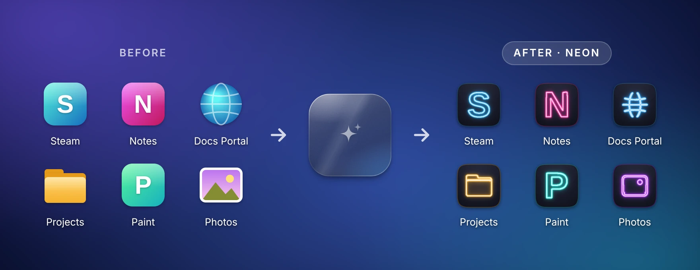
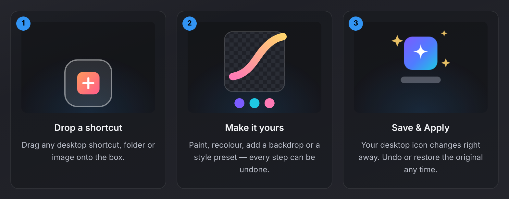
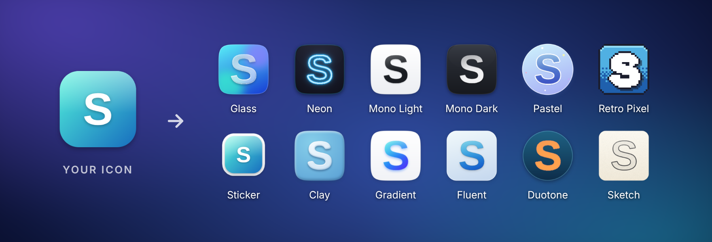

# Reskin

### Give any desktop icon a new look — in seconds.

Drag a shortcut onto the floating box, pick a style, and your desktop icon changes. 
Free for Windows 10 &amp; 11 · No account · Undo anything

2 MB · installs without admin rights · or get the <a href="https://github.com/KarimEidou/Reskin/releases/latest/download/Reskin-Portable.exe">portable version</a>

 

## How it works

## 12 styles, one click

Every style is rebuilt from *your* icon, so your apps stay recognisable. Queued several icons? **Apply style to all** gives your whole desktop the same look.

## Or make it entirely yours

Brushes, shapes, text, stickers and emoji, layers, 20+ adjustments and backdrops — with live previews of your icon at every size, on your own wallpaper and on the taskbar.

## Why Reskin

- ✨ **Instant** — drop an icon, click a style, done.
- ↩️ **Nothing is permanent** — undo one icon, or put every original back in one go.
- 🎮 **Your whole desktop** — app shortcuts, Steam and Epic games, folders, websites, and system icons like This PC and the Recycle Bin.
- 🔒 **Private** — no account, no ads, no tracking. Works offline.
- 🪶 **Light** — a 2 MB download that installs without admin rights.

## Questions

<b>Windows says "Windows protected your PC". Is Reskin safe?</b>

 

Yes. Reskin is new and isn't code-signed yet, so Microsoft Defender SmartScreen doesn't recognise it. Click **More info**, then **Run anyway**. Reskin is open source — every line can be read here — and each release lists the files' SHA-256 checksums in `SHA256SUMS.txt`.

<b>How do I get my old icons back?</b>

 

Right after applying, click **Undo** on the box. Any time later, right-click the box → **Restore all icons…** puts every original back, and **History** in Reskin undoes a single one.

<b>Does Reskin change my apps or games?</b>

 

No. It only changes the icon of the shortcut or folder you drop on it. Programs themselves are never modified.

<b>Where did the box go?</b>

 

Press **Ctrl + Alt + Shift + R**, or choose **Show box** from Reskin's tray icon. The box hides by itself while a full-screen app or game runs. After a restart, open Reskin from the Start menu — or turn on **Settings → Start with Windows**.

<b>Which PCs does it run on?</b>

 

Windows 10 and 11, 64-bit. Reskin uses Microsoft's WebView2, which comes with Windows 11 and current Windows 10; the installer adds it if it's missing.

<b>How do I uninstall it?</b>

 

Windows **Settings → Apps**, find Reskin, **Uninstall**. Tick *Delete app data* to also put all your original icons back first.

<b>Is it really free?</b>

 

Yes. Reskin is free and open source under the MIT license — no trial, no ads, no account.

## More

- 📖 **[User guide](docs/GUIDE.md)** — every feature, keyboard shortcuts, settings, restoring and uninstalling
- 🐞 **[Report a problem or suggest an idea](https://github.com/KarimEidou/Reskin/issues/new/choose)**
- 📝 **[What's new](CHANGELOG.md)**
- 🛠️ **[Build it yourself or contribute](CONTRIBUTING.md)**

 

### Ready for a new look?

If Reskin makes your desktop nicer, a ⭐ helps other people find it.

Reskin is free and open source under the [MIT license](LICENSE).

